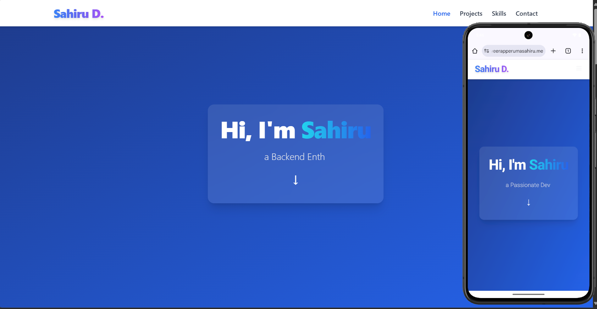
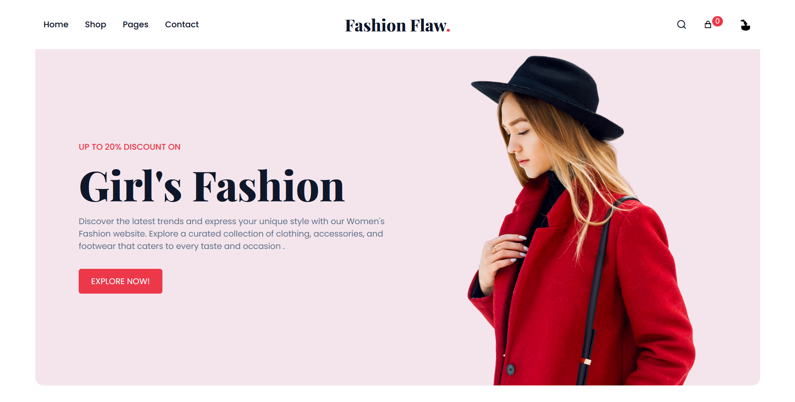
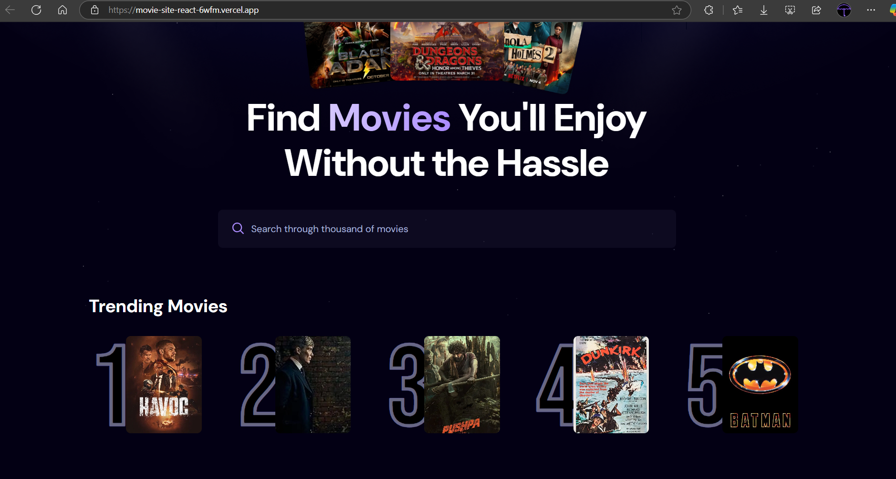

  

<h1 align="center">You found me! Let’s make something cool together.</h1>
<h3 align="center">I'm Sahiru — a software engineer passionate about back-end, DevOps, and Python. I love building reliable systems and exploring new tools.</h3>

---

- 🔭 I’m currently working on [Eazy-School-SpringBoot](https://github.com/weerapperuma/Eazy-School-Application.git)

- 🌱 I’m currently learning **SpringBoot & MERN**

- 📫 You can reach me **weerapperumasahiru.me**

---

<h1 align="center">TECHNOLOGY</h1>

---
<h1 align="center">MY TOP 3 PROJECTS</h1>

<table border="0" cellspacing="0" cellpadding="0" align="center">
  <tr>
    <td style="border: none; padding: 10px;">
      <h4>1. Portfolio</h4>
      
      
A personal portfolio to showcase projects and skills.

      
<strong>Tech Stack:</strong>TypeScript, React, Tailwind

    </td>
    <td style="border: none; padding: 10px;">
      <h4>2. CeylonWear MERN site</h4>
      
      
An e-commerce platform for selling Sri Lankan fashion items.

      
<strong>Tech Stack:</strong> MongoDB, Express, React, Node.js (MERN)

    </td>
  </tr>
  <tr align="center">
    <td style="border: none; padding: 10px;" colspan="2">
      <h4>3. Ultimate Movie Site</h4>
      
      
Description of project 5 goes here.

      
<strong>Tech Stack:</strong> TMDB, Appwrite, React, Vite, Tailwind

    </td>
  </tr>
</table>

---

<h1 align="center">SOCIAL</h1>

---

<h6 align="center">© 2025 Sahiru Deshan</h6>

